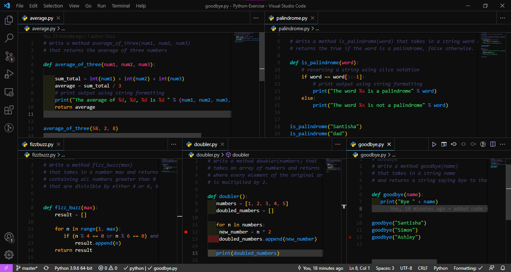

# Python-Exercise

In this project I solved coding problems using Python.

## Project Preview

## Languages Used

- Python

## Contributing

- Pull requests are always welcome. Please open an issue first to discuss what you want to alter if you want to make big changes.
- To clone the project on your local machine, use: git clone <https://github.com/SantishaR/Python-Exercise>;

## License

[MIT](https://choosealicense.com/licenses/mit/)

## Project Author

Santisha Reddy

- Github: [@SantishaR](https://github.com/SantishaR)

## Acknowledgments

 [Code Academy](https://www.codecademy.com/learn/learn-python)
